# Práctica 4.4 deployment of an architecture EFS-EC2-MultiAZ in the CLoud (AWS)

**1. Creamos un grupo de seguridad con las siguientes caracteristicas:**

- Regla de entrada HTTP accesible para todo el mundo (0.0.0.0/0)
- Regla de entrada SSH accesible para todo el mundo (0.0.0.0/0)

    
    

    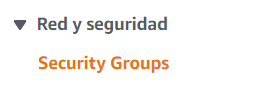

    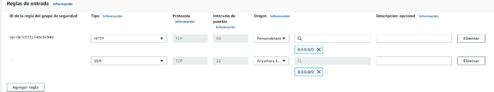

Y creamos otro grupo se seguridad con las siguientes caracteristicas 

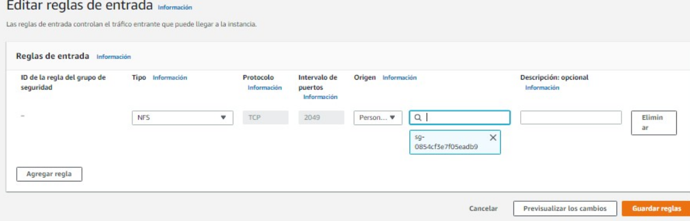

**2. Creación EC2**

Vamos a crear dos instancias EC2 de la siguiente forma:

- AMI Amazon Linux
- Tipo t2.micro
- Configuraciones de red
    - VPC predeterminada
    - Subred con zona de disponibilidad us-east-1a
    - Habilitar asignación de IP pública automáticamente
    - Almacenamiento por defecto
    - Seleccionar grupo de seguridad existente SGWeb
    - En Detalles avanzados --> Datos de usuario, insertaremos los siguientes comandos para la instalación automática de estos al crear nuestras EC2 (también pueden insertarse al arrancar la máquina si no introducimos nada en este paso):
        - #!/bin/bash
        - yum update -y
        - yum install httpd -y
        - systemctl start httpd
        - systemctl enable httpd
        - yum -y install nfs-utils

La otra maquina seria exactamente igual menos en la parte de zona de disponibilidad donde hay que poner el acabado en b

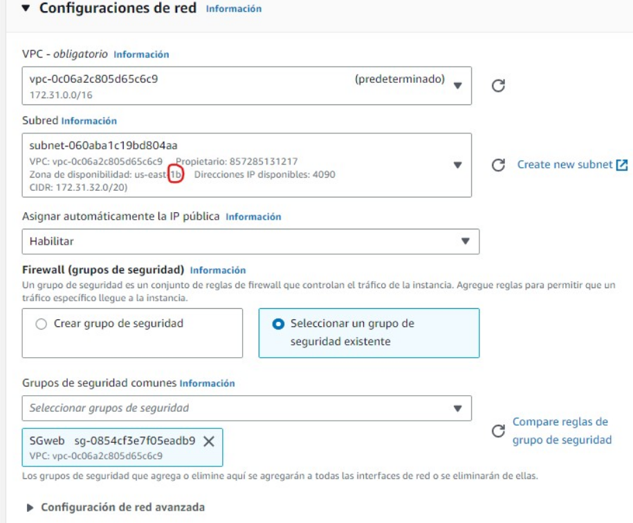

**3. Creación EFS**

Para la creación del Efs utilizaremos las siguientes características:

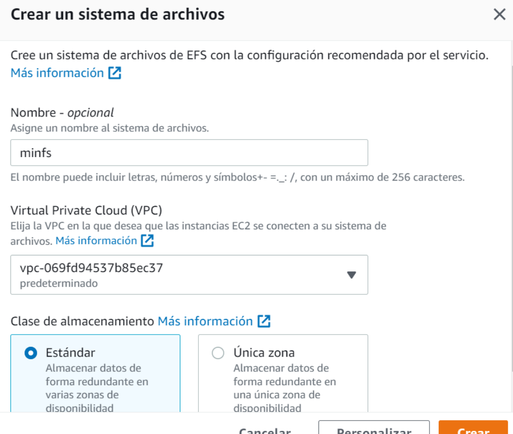

Una vez creada, tenemos que enlazar las zonas de disponibilidad que vamos a utilizar (en este caso, us-east-1a y us-east-1b), con nuestro grupo de seguridad creado anteriormente para Efs.

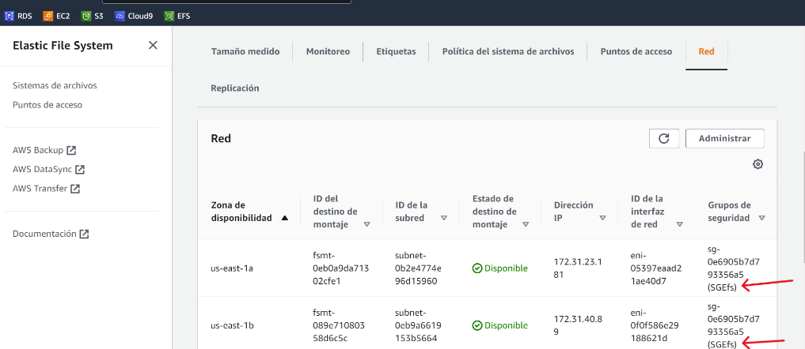

**4. Configuracion de la EC2**

    sudo su

    cd /var/www/html

    sudo mkdir efs-mount

    sudo mount -t nfs -o nfsvers=4.1,rsize=1048576,wsize=1048576,hard,timeo=600,retrans=2,noresvport *ID DE NUESTRO ENFS*.efs.us-east-1.amazonaws.com:/ efs-mount

    cd efs-mount

        sudo wget https://s3.eu-west-1.amazonaws.com/www.profesantos.cloud/Netflix.zip

    sudo unzip Netflix.zip 

    cd efs-mount

    sudo mount -t nfs -o nfsvers=4.1,rsize=1048576,wsize=1048576,hard,timeo=600,retrans=2,noresvport *ID DE NUESTRO ENFS*.efs.us-east-1.amazonaws.com:/ efs-mount

    systemctl restart apache2

Para que no se desmonte tendremos que en cada maquina debremos editar el archivo:

sudo nano /etc/fstab
Dentro de ese archivo pegaremos el DNS del EFS y acontinuacion este comando:

/var/www/html/efs-mount nfs defaults 0 0

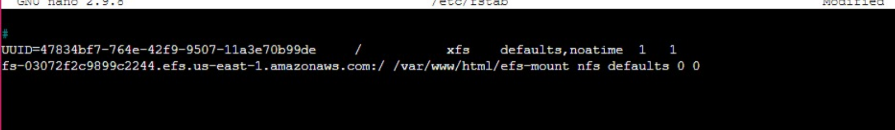

Se editara el archivo de configuracion de Apache2 para que muestre nuestra pagina al introducir nuestra IP con el siguiente comando:

    vim /etc/httpd/conf/httpd.conf

Editamos Document Root para que cuando introduzcamos la IP se muestre nuestra pagina WEB.

En la otra maquina EC2 hacemos exactamente lo mismo 

**5. Creación del balanceador**

A continuación, crearemos un balanceador que conectará las dos instancias EC2. Como AMI elegiremos Ubuntu, y habilitaremos el tráfico HTTP. El resto de configuraciones las dejaremos por defecto.

Una vez este disponible introduciremos los siguientes comandos:

    sudo su                        
    apt get update                 
    apt install apache2            
    a2enmod proxy                  
    a2enmod proxy_http             
    a2enmod proxy_ajp              
    a2enmod rewrite                
    a2enmod deflate                
    a2enmod headers                
    a2enmod proxy_balancer         
    a2enmod proxy_connect          
    a2enmod proxy_html             
    a2enmod lbmethod_byrequests     
    systemctl restart apache2 

Una vez hecho esto escribiremos:

sudo nano /etc/apache2/sites-enabled/000-default.conf

Se añadira este codigo cambiando en #Server1 y # Server2 por nuestra IP

    <Proxy balancer://mycluster> 
    # Server 1 BalancerMember http://ip-http-server-1/ *IP PRIVADA*
    # Server 2 BalancerMember http://ip-http-server-2/ *IP PRIVADA* </Proxy> ProxyPass / balancer://mycluster/

    ProxyPassReverse "/images/" "balancer://myset/"

    <Location "/balancer-manager"> SetHandler balancer-manager Require host localhost </Location>

    <Location /balancer-manager> SetHandler balancer-manager Order Deny,Allow Allow from all </Location>

    ProxyPass /balancer-manager !

**6. Instalar php en ambas maquinas EC2**

    $ sudo yum install -y amazon-linux-extras
    $ sudo yum update
    $ sudo amazon-linux-extras | grep php
    Seleccionaremos en consola la version 8.0

**7. Crear RDS**

También vamos a crear una base de datos, a la cuál posteriormente le pasaremos datos a través de nuestra página web. En este caso, tiene las siguientes configuraciones:

- Plantilla: Produccion
- Configuracion: Instancia BBDD multiAZ

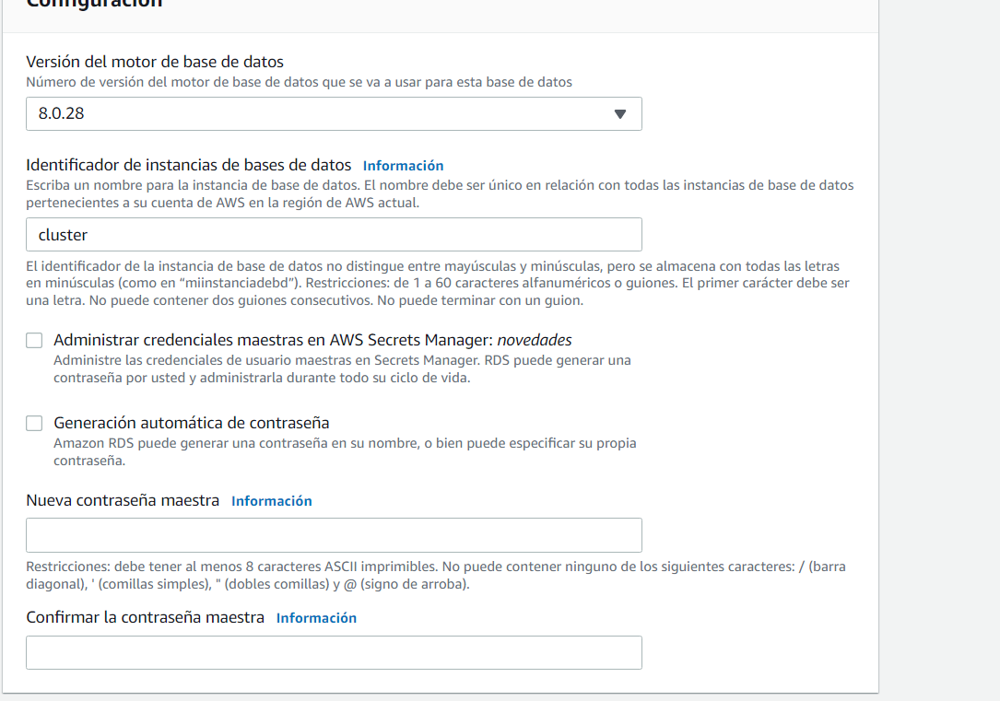
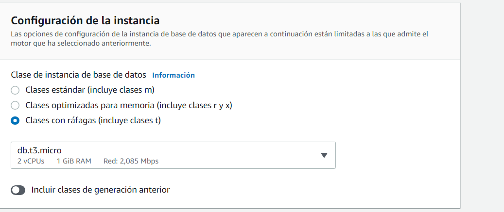
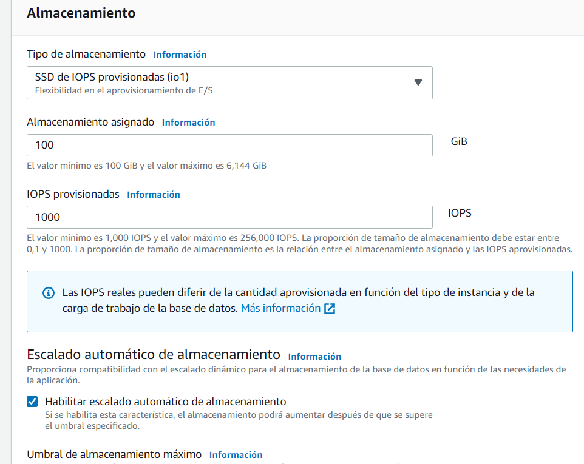
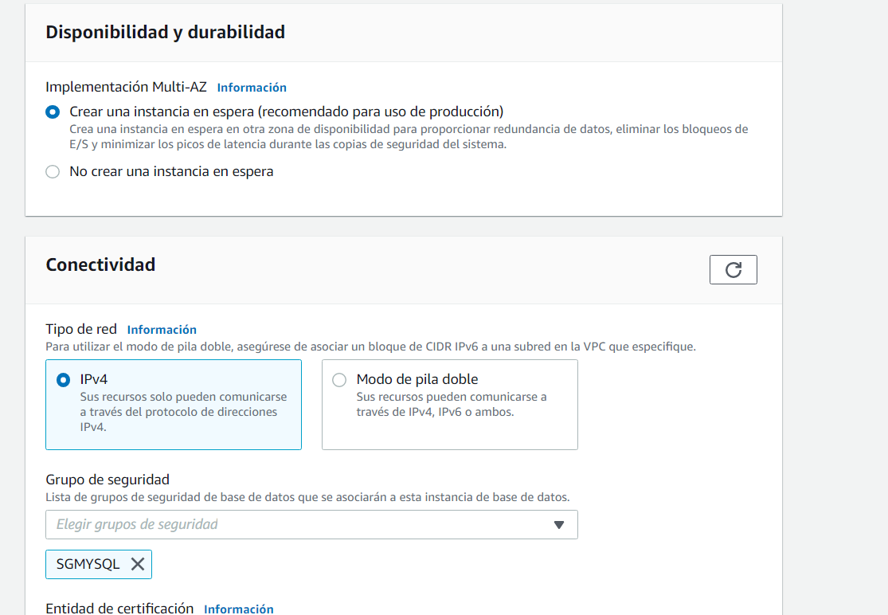

**8. Codigos**

Nos iremos a la siguiente ruta /var/www/html/efs-mount y crearemos/modificaremos los siguientes archivos.

        ----------
        index.html
        ----------

        <!DOCTYPE html>
        <html lang="en">
        <head>
            <meta charset="UTF-8" />
            <meta name="viewport" content="width=device-width, initial-scale=1.0" />
            <link rel="stylesheet" href="style.css" />
            <title>Movie App</title>
        </head>
        <body>
            <header>
            <form id="form">
                <input type="text" id="search" class="search" placeholder="Search">
            </form>
            </header>
        <form action="formulario.php">
            <input class="boton_personalizado" type="submit" value="Donativos Turquia y Siria " />
        </form>
            <main id="main"></main>

            
        </body>
        </html>

        --------------
        formulario.php
        --------------

        <html> 
        <head>
        <meta charset="UTF-8" />
            <meta name="viewport" content="width=device-width, initial-scale=1.0" />
            <link rel="stylesheet" href="style.css" />
        </head>
        <body>
        <header>
            <form id="form">
                <input type="text" id="search" class="search" placeholder="Search">
            </form>
        </header>
        <main id="main">
        <form action="grabar.php" method="post" class="form">

            <label ><h1> DONATIVOS PARA TURQUIA Y SIRIA </h1></label>
            <label for="name">Nombre :</label>
            <input type="text" id="nombre" name="nombre">
             
        <label for="donativo">Donativo: </label>
            <input type="donativo" id="donativo" name="donativo">
             
        
            <input type="radio" name="tipomoneda" value="Euros" checked > Euros 
        <input type="radio" name="tipomoneda" value="Dólares"> Dólares 
             
        <input type="submit" value ="Enviar" name="enviar" /> 
        </form>
        </main>

        </body>
        </html>

        ----------
        grabar.php
        ----------

        <html> 
        <head>
        <meta charset="UTF-8" />
            <meta name="viewport" content="width=device-width, initial-scale=1.0" />
            <link rel="stylesheet" href="style.css" />
        </head>
        <body>
        <header>
            <form id="form">
                <input type="text" id="search" class="search" placeholder="Search">
            </form>
            </header>
        <main id="main">

        <?php
        include ('conexion.php');
        $nombre=$_REQUEST['nombre'];
        $donativo=$_REQUEST['donativo'];
        $tipomoneda=$_REQUEST['tipomoneda'];

        $data = [
            'nombre' => $nombre,
            'donativo' => $donativo,
            'tipomoneda' => $tipomoneda,
        ];
        $sql = "INSERT INTO donativos VALUES (null,:nombre, :donativo, :tipomoneda)";
        $stmt= $conn->prepare($sql);
        $stmt->execute($data);
        echo "
";
        echo "<h2> Has colaborado con ". $donativo. "  " . $tipomoneda."</h2>" ;
        echo "<h2> Donación registrada correctamente. Gracias por su colaboración </h2>";
        echo "<h2><a href='index.html' > Volver a Inicio </a></h2>";
        echo "
";

        echo "
";
        $sql = 'SELECT sum(donativo) as total from donativos;';
            foreach ($conn->query($sql) as $row) {
                echo "TOTAL RECAUDADO ".$row['total'] . "\n";
            }
        echo "
";
        ?>
        </main>
        </body>
        </html>

        ------------
        conexion.php
        ------------

        <?php
        $servername = "cluster.conbsi1k7qo3.us-east-1.rds.amazonaws.com";
        $username = "admin";
        $password = "Root1234$";
        $bd="Cluster";

        try {
            $conn = new PDO("mysql:host=$servername;dbname=$bd", $username, $password);
        } catch (PDOException $pe) {
            die("Could not connect to the database $dbname :" . $pe->getMessage());
        }
        ?>

        ----------
        prueba.php
        ----------

        <?php 

        phpinfo(); 

        ?>

        ------------
        Código tabla
        ------------

        CREATE DATABASE Cluster;
        USE Cluster;
        CREATE TABLE donativos (
        id INT(5) PRIMARY KEY AUTO_INCREMENT,
        nombre VARCHAR(30) NOT NULL,
        donativo DECIMAL (8,2) NOT NULL,
        tipomoneda CHAR(5) CHECK (tipomoneda IN ('Euros','Dólares')));

**9. Securización**

- SGMySql

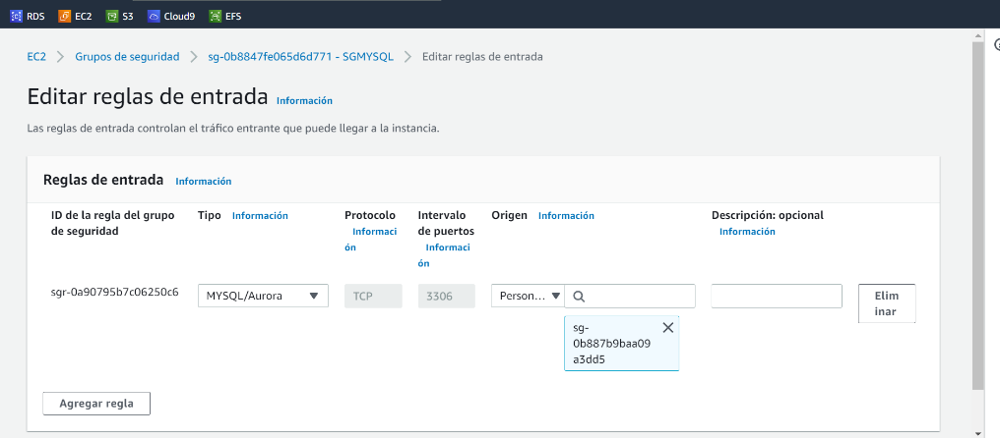

- SGWeb ( donde vamos a poner la ip publica del balanceador)

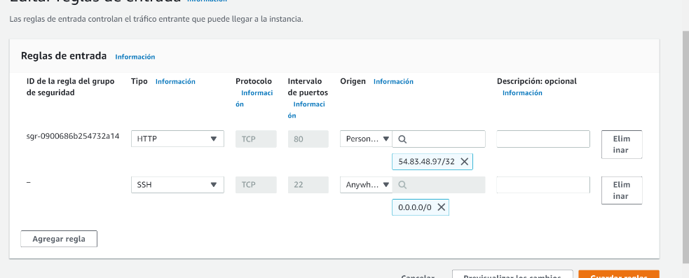
